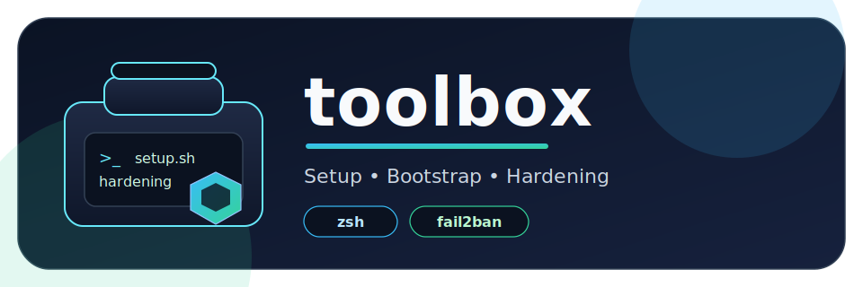

<div align="center">
  
  <p>Setup, bootstrap, and hardening scripts for provisioning and maintaining Linux systems.</p>
  <p>
    <a href="https://github.com/dkennerknecht/toolbox">
      
    </a>
    <a href="https://github.com/dkennerknecht/toolbox/network/members">
      
    </a>
    <a href="https://github.com/dkennerknecht/toolbox/commits/main">
      
    </a>
    <a href="https://github.com/dkennerknecht/toolbox">
      
    </a>
  </p>
</div>

## Available scripts

- `setup-zsh.sh`: shared Oh-My-Zsh setup for one or many users
- `setup-fail2ban.sh`: fail2ban installation + baseline hardening for SSH/web stacks
- `setup-backup-client.sh`: install and configure Proxmox Backup Client on apt-based systems

## `setup-zsh.sh`

### What it does

- Installs required packages: `zsh`, `vim`, `git`, `curl`, `ca-certificates`, `fzf`
- Installs one shared Oh-My-Zsh tree in `/opt/ohmyzsh`
- Installs shared plugins in `/opt/ohmyzsh/custom/plugins`
- Creates/updates per-user `~/.zshrc` files (managed content)
- Optionally switches default shell to zsh (`chsh`)
- Installs a central cron updater for OMZ/plugins every 30 days

### Supported package managers

- `apt`
- `dnf`
- `yum`
- `pacman`
- `apk`
- `zypper`

### Usage

```bash
sudo bash setup-zsh.sh [options]
```

### One-liner download + install

```bash
curl -fsSL https://raw.githubusercontent.com/dkennerknecht/toolbox/main/setup-zsh.sh | sudo bash
```

### Options

| Option | Description |
|---|---|
| `--users "alice,bob"` | Install for a specific comma-separated user list |
| `--all-users` | Install for `root` + all local "real" users (UID >= 1000, valid shell, existing home) |
| `--no-chsh` | Do not change default shell |
| `--dry-run` | Print actions without changing the system |
| `-h`, `--help` | Show help |

### Default behavior

- If no user option is given, target is `SUDO_USER` (if set and not `root`), otherwise `root`.

### Examples

```bash
# Default target user (SUDO_USER or root)
sudo bash setup-zsh.sh

# Multiple explicit users
sudo bash setup-zsh.sh --users "alice,bob"

# Root + all regular users
sudo bash setup-zsh.sh --all-users

# Keep login shells unchanged
sudo bash setup-zsh.sh --all-users --no-chsh

# Preview only
sudo bash setup-zsh.sh --all-users --dry-run
```

### Files and paths managed

- `/opt/ohmyzsh`
- `/opt/ohmyzsh/custom/plugins/*`
- `/etc/cron.daily/ohmyzsh-shared-update`
- `/var/lib/ohmyzsh-shared-update.last`
- `/etc/shells` (adds zsh path when missing)
- `/root/.zshrc` and selected users' `~/.zshrc`

## `setup-fail2ban.sh`

### What it does

- Installs `fail2ban`
- Writes managed jail config to `/etc/fail2ban/jail.d/10-toolbox-hardening.local`
- Enables baseline hardening jails: `recidive` (always) and `sshd` (auto/optional)
- Supports optional service-specific hardening jails for Nginx (`nginx-http-auth`, `nginx-botsearch`), Apache (`apache-auth`, `apache-badbots`), WordPress (`toolbox-wordpress`), and Nextcloud (`toolbox-nextcloud`)
- Auto-detects running services and typical log files, and enables only applicable jails
- Validates config with `fail2ban-client -t` and restarts/enables the service

### Supported package managers

- `apt`
- `dnf`
- `yum`
- `pacman`
- `apk`
- `zypper`

### Usage

```bash
sudo bash setup-fail2ban.sh [options]
```

### One-liner download + install

```bash
curl -fsSL https://raw.githubusercontent.com/dkennerknecht/toolbox/main/setup-fail2ban.sh | sudo bash
```

### Interactive behavior

- With no arguments and an interactive TTY, the script starts an interactive wizard automatically
- Force interactive mode with `--interactive`
- Force non-interactive mode with `--non-interactive`

### Options

| Option | Description |
|---|---|
| `--interactive` | Start interactive wizard |
| `--non-interactive` | Disable interactive wizard |
| `--auto` | Enable automatic service detection (default) |
| `--no-auto` | Disable automatic service detection for `auto` modes |
| `--ssh` | Force-enable SSH jail logic |
| `--no-ssh` | Force-disable SSH jail logic |
| `--nginx` | Force-enable Nginx jail logic |
| `--no-nginx` | Force-disable Nginx jail logic |
| `--apache` | Force-enable Apache jail logic |
| `--no-apache` | Force-disable Apache jail logic |
| `--wordpress` | Force-enable WordPress jail logic |
| `--no-wordpress` | Force-disable WordPress jail logic |
| `--nextcloud` | Force-enable Nextcloud jail logic |
| `--no-nextcloud` | Force-disable Nextcloud jail logic |
| `--bantime <time>` | Default ban duration (default: `1h`) |
| `--findtime <time>` | Default detection window (default: `10m`) |
| `--maxretry <n>` | Default allowed failures before ban (default: `5`) |
| `--ignore-ip <list>` | Space- or comma-separated IP/CIDR allowlist |
| `--dry-run` | Print actions without changing the system |
| `-h`, `--help` | Show help |

### Examples

```bash
# Interactive wizard (auto when no args + TTY)
sudo bash setup-fail2ban.sh --interactive

# Automatic detection with defaults
sudo bash setup-fail2ban.sh

# Explicit web stack hardening
sudo bash setup-fail2ban.sh --nginx --wordpress

# Manual mode selection without auto detection
sudo bash setup-fail2ban.sh --no-auto --ssh --apache

# Dry-run preview
sudo bash setup-fail2ban.sh --interactive --dry-run
```

### Files and paths managed

- `/etc/fail2ban/jail.d/10-toolbox-hardening.local`
- `/etc/fail2ban/filter.d/toolbox-wordpress.conf` (when WordPress jail enabled)
- `/etc/fail2ban/filter.d/toolbox-nextcloud.conf` (when Nextcloud jail enabled)
- `/var/log/fail2ban.log` (created when missing)

## `setup-backup-client.sh`

### What it does

- Installs prerequisites: `curl`, `ca-certificates`, `gnupg`
- Detects distribution codename from `/etc/os-release` (fallback: `lsb_release`)
- Installs Proxmox signing key to `/usr/share/keyrings/proxmox-archive-keyring.gpg`
- Configures APT repository file at `/etc/apt/sources.list.d/pbs-client.list`
- Installs `proxmox-backup-client`
- Optionally walks through interactive repository setup and writes `~/.config/proxmox-backup/client.conf`
- Optionally creates `/usr/local/bin/pbs-backup-root` helper script

### Supported package managers

- `apt`

### Usage

```bash
sudo bash setup-backup-client.sh
```

### One-liner download + install

```bash
curl -fsSL https://raw.githubusercontent.com/dkennerknecht/toolbox/main/setup-backup-client.sh | sudo bash
```

### Interactive behavior

- Installs packages non-interactively
- Prompts for PBS repository details only when running with an interactive TTY

### Files and paths managed

- `/usr/share/keyrings/proxmox-archive-keyring.gpg`
- `/etc/apt/sources.list.d/pbs-client.list`
- `~/.config/proxmox-backup/client.conf` (when repository setup is chosen)
- `/usr/local/bin/pbs-backup-root` (when example script creation is chosen)

## Notes

- All scripts require root privileges (`sudo`).
- All scripts are designed to be idempotent and can be re-run.
